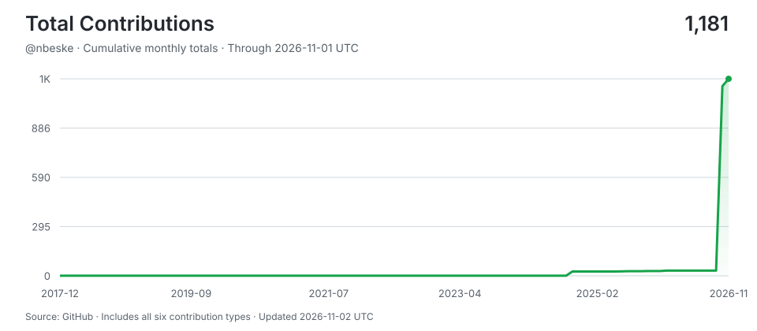

## Hi, I'm Nick 👋

Founder & CEO of **[PointClick®](https://pointclick.io/)**, a digital marketing agency that works exclusively with law firms.

I've been building websites since 1996 and doing digital marketing since 2008. I started PointClick in Southern California, and today we help solo, small and mid-sized law firms across the U.S. get found online and bring in more cases.

**What we do**

- 🌐 Law firm websites, hosting and maintenance
- 🔎 SEO and Google Business Profile / Maps
- 🤖 AI search visibility (ChatGPT, Google AI and other AI tools)
- 📈 Google Ads (PPC and Local Services Ads)
- ⭐ Reviews and reputation

**How I work**

> "Good digital marketing should be understandable, practical, and tied to the goals of the business."

I work directly with every client, explain things in plain English, and don't lock firms into long-term contracts.

**Find me**

- 🌍 [pointclick.io](https://pointclick.io/)
- 💼 [LinkedIn](https://www.linkedin.com/in/nickbeske/)

Most of my repositories are private client and operations work.

<!-- STATS-START -->
## Work with AI

| Metric | Yesterday | Prior 7 Days | Prior 28 Days | Prior 365 Days |
| --- | ---: | ---: | ---: | ---: |
| Screen time (Mac) | unavailable | unavailable | 45.4h | ~5524h* |
| Interactive human attention | 0.0h | 0.0h | 0.0h | 0.0h |
| Interactive AI generation | 0.0h | 0.0h | 0.0h | 0.0h |
| Worker-classified human attention | 0.0h | 0.0h | 0.0h | 0.0h |
| Worker/headless AI generation | 6.1h | 31.3h | 54.4h | 54.7h |
| Additive observed work | 6.1h | 31.3h | 54.4h | 54.7h |
| Interactive sessions | 0 | 0 | 0 | 0 |
| Worker sessions | 30 | 136 | 228 | 230 |

_Screen time from screen-time-history:daily-observations; collection status: stale, unavailable (no-display-assertions). *365-day estimate uses observed calendar coverage._

_Periods are completed local calendar days ending at midnight; today is excluded._

_Human attention is unioned wall-clock time, so overlapping sessions are not double-counted. AI generation is additive machine work across sessions; it is not wall-clock concurrency._

_AI session 365-day totals cover 30 days of local assistant session history (not extrapolated)._

## AI Model Usage (last 30 days)

| Model | Requests | Input | Output | Cache read | Cache write | Cache Hit-Rate % | Session Count | Session Hours |
| --- | ---: | ---: | ---: | ---: | ---: | ---: | ---: | ---: |
| claude-opus-5-5 | 114,473 | 4.2M | 78.0M | 26,045.8M | 970.3M | 96.4% | 220 | 376.7h |
| gpt-5.5 | 1,607 | 5.8M | 546K | 107.4M | 0 | 94.8% | 5 | 2.4h |
| gpt-6.1-sol | 368 | 2.9M | 63K | 121.2M | 0 | 97.7% | 1 | 0.4h |
| claude-haiku-5-5 | 191 | 440 | 72K | 7.7M | 901K | 89.6% | 5 | 0.5h |
| gpt-5.6-luna | 60 | 224K | 6K | 1.2M | 0 | 84.9% | 1 | 0.0h |
| gpt-6-luna | 7 | 64K | 35 | 0 | 0 | 0.0% | 1 | 0.0h |
| **Total** | **116,706** | **13.3M** | **78.7M** | **26,283.6M** | **971.2M** | **96.4%** | **228** | **380.1h** |

_27,346.9M total tokens processed. 96.4% cache hit rate._

## AI Model Usage (all time)

| Model | Requests | Input | Output | Cache read | Cache write | Cache Hit-Rate % | Session Count | Session Hours |
| --- | ---: | ---: | ---: | ---: | ---: | ---: | ---: | ---: |
| claude-opus-5-5 | 114,632 | 4.2M | 78.1M | 26,057.9M | 970.7M | 96.4% | 221 | 377.3h |
| gpt-5.5 | 1,655 | 6.4M | 558K | 112.7M | 0 | 94.6% | 6 | 2.5h |
| gpt-6.1-sol | 368 | 2.9M | 63K | 121.2M | 0 | 97.7% | 1 | 0.4h |
| claude-haiku-5-5 | 191 | 440 | 72K | 7.7M | 901K | 89.6% | 5 | 0.5h |
| gpt-5.6-luna | 60 | 224K | 6K | 1.2M | 0 | 84.9% | 1 | 0.0h |
| gpt-6-luna | 7 | 64K | 35 | 0 | 0 | 0.0% | 1 | 0.0h |
| **Total** | **116,913** | **13.8M** | **78.8M** | **26,301.0M** | **971.6M** | **96.4%** | **230** | **380.8h** |

_27,365.3M total tokens processed. 96.4% cache hit rate._
<!-- STATS-END -->

<!-- CONTRIBUTIONS-START -->
<!-- CONTRIBUTIONS-END -->

---

<!-- UPDATED-START -->
_Stats auto-updated 2026-11-06 01:23 UTC by [aidevops](https://aidevops.sh) pulse._
<!-- UPDATED-END -->

<!-- TOTAL-CONTRIBUTIONS-START -->

  <a href="https://commit-history.com/nbeske?metric=total" target="_blank" rel="noopener noreferrer">
    <picture>
      <source media="(prefers-color-scheme: dark)" srcset="assets/contributions/total-dark.svg" />
      
    </picture>
  </a>

[Verify on commit-history.com](https://commit-history.com/nbeske?metric=total) · [Chart data](assets/contributions/total.json)

Includes commits, issues, pull requests, reviews, repositories, and restricted contributions. Refreshed daily through the prior UTC day; commit-history.com may use a different refresh cutoff. GitHub controls link navigation—Ctrl/Cmd-click opens verification in a new tab.
<!-- TOTAL-CONTRIBUTIONS-END -->
